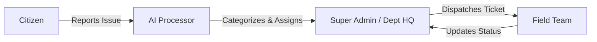

<div align="center">
  <h1>Civic Intelligence OS</h1>
  <h3>The Future of Urban Governance & City Management</h3>
  
  <p>
    
    
    
    
  </p>

  <p>
    <strong>Civic-intel-OS</strong> is a government-grade administrative dashboard designed to streamline city operations. 
    <br />
    It powers real-time automated assessment, intelligent workforce dispatching, and multi-departmental coordination.
  </p>
</div>

<hr />

## 🚀 Key Features

<table>
  <tr>
    <td width="50%">
      <h3 align="center">🏛️ Unified Command Center</h3>
      <ul>
        <li><strong>Dynamic Dispatch Map</strong>: Real-time tracking of field teams with live status (Available, Busy, Offline).</li>
        <li><strong>Smart Auto-Assign</strong>: Algorithm matching tickets to departments and teams with the lowest workload.</li>
        <li><strong>Priority Scoring</strong>: AI-driven assessment ensuring critical issues (Roads, Water) are addressed first.</li>
      </ul>
    </td>
    <td width="50%">
      <h3 align="center">🛡️ Role-Based Access (RBAC)</h3>
      <ul>
        <li><strong>Super Admin</strong>: Global oversight, system settings, and audit logs.</li>
        <li><strong>Department HQ</strong>: Dedicated portals for 6 key departments (Roads, Sanitation, Electrical, etc.).</li>
        <li><strong>Team Management</strong>: HQ-managed rosters and shift capacities.</li>
      </ul>
    </td>
  </tr>
</table>

<div align="center">
  <h3>🤖 AI Integration</h3>
  <p>Powered by <strong>Google Gemini Pro</strong></p>
  <p>
    <em>Automatic categorization • Severity evaluation • Concise issue summarization</em>
  </p>
</div>

## 🛠️ Technology Stack

| Feature | Tech Choices |
|:---|:---|
| **Frontend** | `Next.js 16 (App Router)` • `React 19` • `TailwindCSS 4` • `Lucide Icons` |
| **State** | `React Context API` • `Hooks` |
| **Backend** | `Firebase Firestore` (NoSQL) • `Firebase Authentication` |
| **Maps** | `Leaflet.js` • `OpenStreetMap` |
| **AI Engine** | `Google Gemini Pro` |

## 📋 Architecture

The system uses a direct **Command-to-Execution** pipeline, removing legacy intermediaries for efficiency.



## 🔧 Installation & Setup

1.  **Clone the Repository**
    ```bash
    git clone -b aeztrix https://github.com/SHIN-1O1/Civic-intel-OS.git
    cd Civic-intel-OS
    ```

2.  **Install Dependencies**
    ```bash
    npm install
    ```

3.  **Environment Configuration**
    Create a `.env.local` file:
    ```env
    NEXT_PUBLIC_FIREBASE_API_KEY=your_key
    NEXT_PUBLIC_FIREBASE_AUTH_DOMAIN=your_domain
    NEXT_PUBLIC_FIREBASE_PROJECT_ID=your_id
    # ... (see PORTAL_SETUP.md for full list)
    GEMINI_API_KEY=your_gemini_key
    ```

4.  **Launch**
    ```bash
    npm run dev
    ```

---

<div align="center">
  <p>Built for the next generation of smart cities.</p>
</div>
