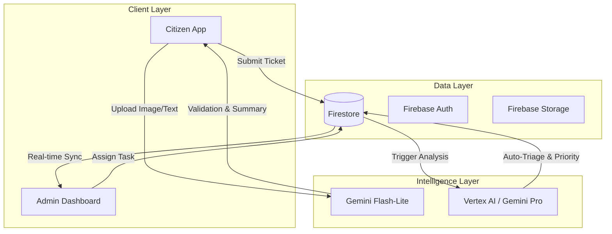

# Civic Intelligence OS - System Design Document

## 1. System Overview

Civic Intelligence OS is a dual-application ecosystem designed to bridge the gap between citizens and city administration through AI-driven automation and real-time data processing.

### The Two Pillars
1.  **Civic Connect (Citizen App)**: A mobile-first web application for citizens to report issues via an AI chatbot interface.
2.  **Civic Intel OS (Admin Dashboard)**: A command center for city officials to manage, triage, and resolve issues.

---

## 2. High-Level Architecture

---

## 3. User Experience (UX) Design

### 3.1 Citizen Journey (Civic Connect)
*   **Design Philosophy**: "Simplicity & Empathy." The interface mimics a chat app (like WhatsApp) to reduce friction.
*   **Key Flows**:
    1.  **Landing**: Minimalist "Report Issue" button.
    2.  **Chat Interface**: AI asks, "What's wrong?" -> User: "Potan hole on Main St" -> AI: "Can you share a photo?"
    3.  **Location Picker**: Map view to pin exact location.
    4.  **Confirmation**: "Ticket #123 created. ETA: 2 days."

### 3.2 Admin Journey (Civic Intel OS)
*   **Design Philosophy**: "Information Density & Actionability." High-contrast dashboard for rapid decision-making.
*   **Key Flows**:
    1.  **Command Center**: Live map showing heatmaps of active issues.
    2.  **Triage Queue**: List of unassigned tickets, sorted by AI-predicted severity.
    3.  **Department View**: Specific views for Roads, Sanitation, etc.
    4.  **Team Management**: Assign tickets to field units (e.g., "Team Alpha - 2km away").

---

## 4. Database Schema (Firestore)

### `users` (Citizens)
*   `uid`: string
*   `phone`: string
*   `gamificationPoints`: number

### `tickets` (Core Entity)
*   `id`: string
*   `status`: 'open' | 'in_progress' | 'resolved' | 'rejected'
*   `category`: 'roads' | 'sanitation' | 'electrical' | ...
*   `severity`: 'low' | 'medium' | 'high' | 'critical'
*   `summary`: string (AI generated)
*   `description`: string (Original user text)
*   `location`: { `lat`: number, `lng`: number, `address`: string }
*   `images`: string[] (URLs)
*   `assignedTo`: string (Team ID)
*   `citizenId`: string
*   `createdAt`: timestamp

### `portalUsers` (Admins)
*   `uid`: string
*   `role`: 'super_admin' | 'department_hq'
*   `department`: string (optional)

### `teams` (Field Units)
*   `id`: string
*   `name`: string
*   `status`: 'available' | 'busy'
*   `currentLocation`: { `lat`: number, `lng`: number }

---

## 5. UI/Visual Design System

### 5.1 Color Palette
*   **Primary (Brand)**: `slate-900` (Professional/Govt)
*   **Secondary (Action)**: `blue-600` (Trust)
*   **Severity Indicators**:
    *   Creates Urgency: `red-500` (Critical)
    *   Warning: `amber-500` (High)
    *   Info: `blue-500` (Medium)
    *   Low: `slate-500` (Low)

### 5.2 Typography
*   **Font Family**: `Inter` (Clean, legible, modern).
*   **Headers**: Bold, tight tracking.
*   **Body**: Regular, relaxed line-height for readability.

### 5.3 Components (Shadcn/UI)
*   **Cards**: Used for ticket summaries.
*   **Badges**: Status and severity labels.
*   **Dialogs**: For detailed ticket views and assignment flows.
*   **Toasts**: Success/Error feedback.

---

## 6. AI Integration Strategy

### 6.1 Frontend (Gemini Flash-Lite)
*   **Purpose**: Immediate user feedback.
*   **Tasks**:
    *   **Validation**: "Is this a valid complaint?" (Reject non-civic issues).
    *   **Information Extraction**: "Extract the category and urgency from this text."

### 6.2 Backend (Gemini Pro)
*   **Purpose**: Deep analysis and routing.
*   **Tasks**:
    *   **Duplicate Detection**: "Is this the same pothole reported 10 mins ago?"
    *   **Strategic Triage**: "Assign to Roads Dept, High Priority."

---

## 7. Security & Access Control

*   **Authentication**: Firebase Auth (Phone for Citizens, Email/Password for Admins).
*   **Authorization (RBAC)**:
    *   **Super Admin**: Can see/edit EVERYTHING.
    *   **Department HQ**: Can only see tickets matching their `department` field.
    *   **Citizen**: Can only see/edit their OWN tickets.
